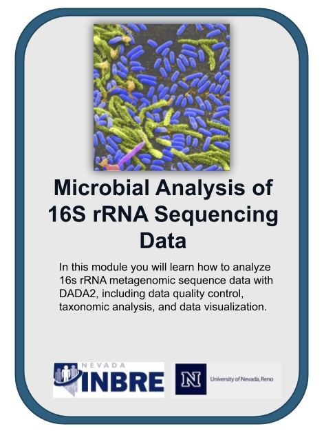
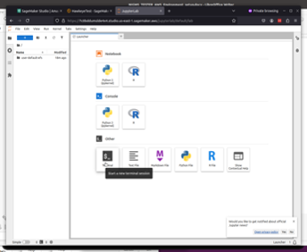
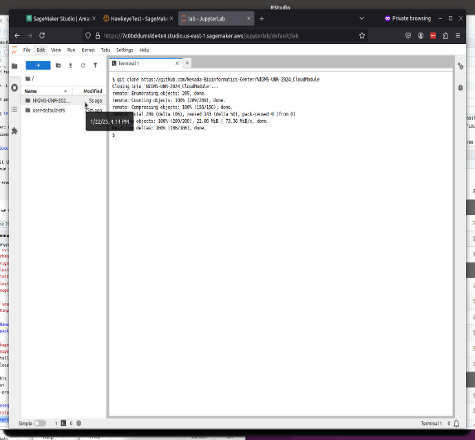
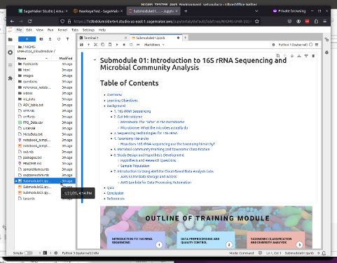
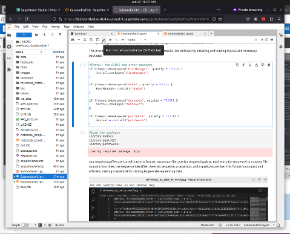

# Microbial analysis of 16S rRNA sequencing data

## **Contents**

- [Microbial analysis of 16S rRNA sequencing data](#microbial-analysis-of-16s-rrna-sequencing-data)
  - [**Contents**](#contents)
  - [**Overview**](#overview)
  - [**Background**](#background)
  - [**Before Starting**](#before-starting)
  - [**Getting Started**](#getting-started)
  - [**Software Requirements**](#software-requirements)
  - [**Architecture Design**](#architecture-design)
  - [**Data**](#data)
  - [**Funding**](#funding)
  - [**License for Data**](#license-for-data)

## **Overview**

This cloud-based learning module introduces the principles of 16S rRNA sequencing and its applications in microbial community analysis. 16S rRNA gene sequencing is a commonly used method to study the diversity and composition of microbial communities by focusing on a specific region of the ribosomal RNA (rRNA) gene that is present in all bacteria. This sequencing technique generates a vast amount of data. Understanding how to process and analyze this data through a series of computational steps is critical in studies related to the human gut microbiome, among others.

The overall structure of the module is explained below:

- [Submodule 01](Submodule01.ipynb) aims to provide an understanding of the principles of 16S rRNA sequencing and its applications in microbial community profiling.
- [Submodule 02](Submodule02.ipynb) teaches how to preprocess raw 16S rRNA sequencing data and perform quality control checks to ensure reliable results.
- [Submodule 03](Submodule03.ipynb) covers taxonomic classification of 16S rRNA sequences, evaluating rarefaction curves, and analyzing alpha and beta diversity in microbial communities.

## **Background**

The study of microbial communities and their dynamics is essential for understanding ecosystems, human health, and environmental processes. Traditional methods of identifying and characterizing microorganisms, such as culturing, often fail to capture the full diversity of microbes present in a given sample. This is where molecular techniques, particularly 16S rRNA sequencing, have revolutionized microbial analysis.

16S rRNA sequencing focuses on a component of the small subunit of the ribosome found in all bacteria and archaea. This gene is highly conserved among different species, but also contains hypervariable regions that differ between taxa, making it an ideal target for identifying and classifying microbes at various taxonomic levels - from phylum to species. 

The process involves amplifying the gene from environmental DNA samples, followed by sequencing and bioinformatic analysis. The resulting data provides a detailed profile of the microbial community present in a sample, including the relative abundance of various species. This has profound applications in fields such as environmental microbiology, clinical diagnostics, gut microbiome research, and biotechnology, where understanding microbial composition can reveal important insights into health, disease, and ecological function.

The objective of this module is to enhance understanding of 16S rRNA sequencing principles by analyzing microbial community composition and diversity. This involves bioinformatics, including quality control, sequence processing, taxonomic assignment, and diversity analysis.

## **Before Starting**

This learning module was designed to be executed on Amazon Web Services (AWS) cloud platform, with the aim of requiring nothing but the files within this GitHub repository.

## **Getting Started**

 Each learning sub-modules is organized in Jupyter notebooks with step-by-step hands-on practice. This module uses the coding languge R to install necessary tools, obtain data, perform analyses, and visualize the results. Please, follow the steps highlighed [here] to create a new user account in AWS, open AWS Sagemaker Studio and launch JupyterLab.

- Step 1: Open the Terminal to clone the GitHub repository with the modules and the data. Use the Git command
 ```
 git clone https://github.com/Nevada-Bioinformatics-Center/NIGMS-UNR-2024_CloudModule
 ```
  
- Step 2: After running the command, a new folder will be visible in the left pane labeled "NIGMS-UNR-202..". Select it.
  
- Step 3: Select `Submodule01.ipynb` file in the left pane to open it in the center pane.
  
- Step 4: Once done with `Submodule01.ipynb`, proceed by closing it in the center pane, then opening `Submodule02.ipynb`. Likewise, perform the same operation when proceeding to `Submodule03.ipynb`
- Step 5: When reading through the tutorial, users will encounter code blocks that can be executed in JupyterLab by either clicking on the cell and pressing `Shift + Enter` or by pressing the `Play` button in the top toolbar.
  

## **Software Requirements**


## **Architecture Design**


## **Data**

 Gut microbiome data from the **WOLFPACK Study** (Wide Open Local Fecal sample collection comparing Pharmaceutical intake, ACtivity, and dietary intaKe) analyzed in this cloud module is made possible thanks to the permission of Dr. Steven Frese, Assistant Professor and the Principal Investigator of the study. Conducted by the University of Nevada, Reno , the **WOLFPACK** study investigates the effects of diet, health, and lifestyle impact on the gut microbiome of adults living in Northern Nevada.

## **Funding**

The project described was fully supported by a grant from the _National Institute of General Medical Sciences_ of the _National Institutes of Health_ under Award Number _GM103440_

## **License for Data**